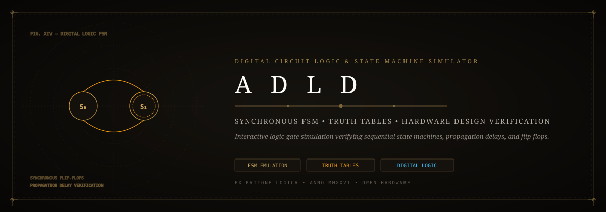
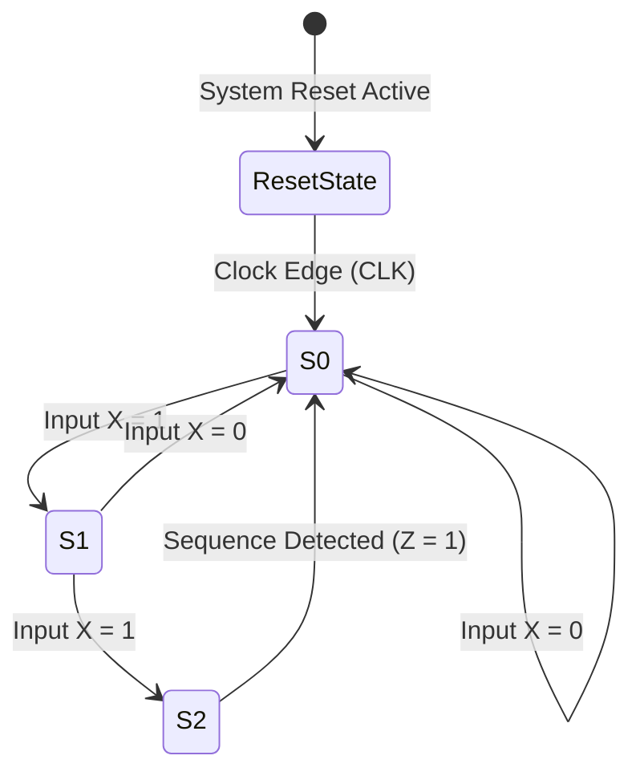

# 🔌 ADLD: Advanced Digital Logic & State Machine Simulator
### *Synchronous Finite State Machines (FSM), Logic Gate Emulation & Truth Table Verification*

*An interactive digital circuit and sequential state machine simulator verifying flip-flop state transitions, propagation delays, and Boolean logic reduction.*

---

## ⚡ The Architectural Vision

Visualizing synchronous sequential logic, propagation delays, and edge-triggered state transitions during hardware design is essential for computer architecture education.

**ADLD** provides an empirical simulation environment for digital systems:
- **Sequential State Machine Modeling**: Mealy and Moore Finite State Machine (FSM) state transition analysis.
- **Synchronous Flip-Flops**: D, T, and JK flip-flop excitation table validation.
- **Combinational Optimization**: Karnaugh Map (K-Map) minimization and Boolean reduction proofs.

---

## 🏗️ State Machine Architecture

---

## 🧩 Antigravity Skills & Tooling

- **`clean-code`**: Modular separation between combinational gate logic and sequential clock registers.
- **`diagram-design`**: State transition diagrams and gate-level circuit schematics.

---

## 📄 License

Distributed under the [MIT License](LICENSE). Maintained by [Jaswanth Reddy](https://github.com/Jaswanth1902) — *Passionate learner & creative problem solver learning from and giving back to the open-source community.*
